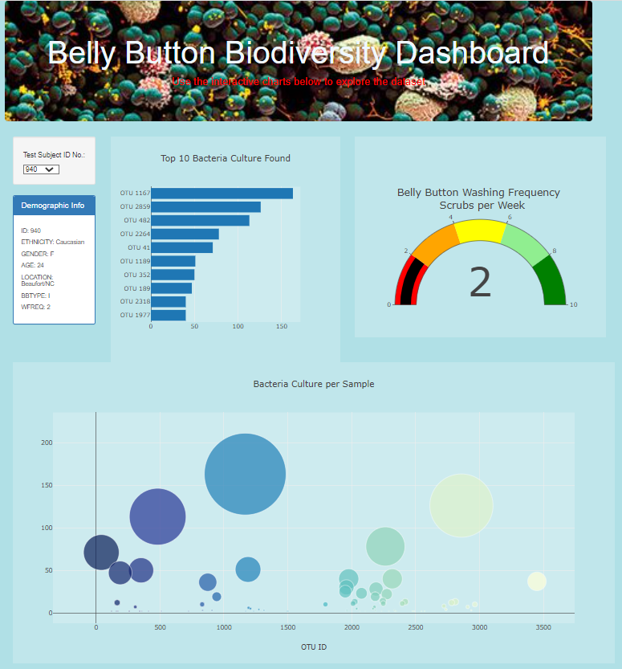

# Belly_Button_Biodiversity

## Background

We have a belly button biodiversity website to show the demographic information of a test volunteer.  We will enhance the website by adding a horizontal bar chart, a bubble chart, a gauge chart of the top 10 bacterial species in their belly buttons.  The website was deployed on github pages.

### Results:

URL:    https://dataanalysis-2022.github.io/Belly_Button_Biodiversity/

